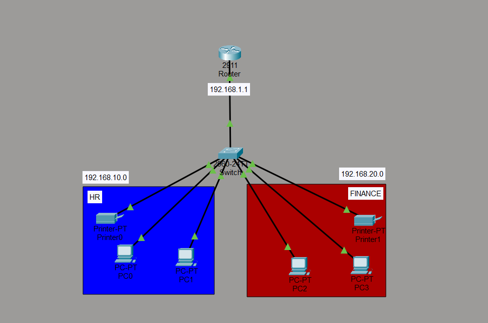

# Router-on-a-Stick (Inter-VLAN Routing) Lab

This project demonstrates the configuration of a network topology in Cisco Packet Tracer to enable communication between different VLANs (HR and Finance) using a single physical interface on a router (Router-on-a-Stick).

## Network Topology

##Technologies & Protocols
* Static IP addressing, hostname and password, VLANS, trunk port, creating subinterfaces, testing connectivity

## Verification
After configuring the subinterfaces on the router and the trunk port on the switch, end-to-end connectivity was successfully verified. A ping test was performed and confirmed successful communication between host PCs in the HR department and the Finance department.

